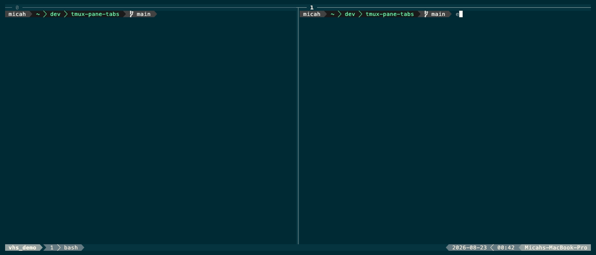

# tmux-pane-tabs

A tmux plugin that gives each pane layout slot multiple live shells. Hidden tabs are real tmux panes parked in a backing session, so their processes and scrollback keep running.



## Features

- **Multiple shells per pane slot** — create tabs in any pane without changing your layout
- **Pane border tab indicator** — the border above each pane shows `[2/3] bash` when tabs are active
- **Zoom preservation** — switching tabs while a pane is zoomed keeps it zoomed
- **Live backing store** — hidden tabs keep running; switch back and your process is still there

## Install

Clone the repository, then add this to `~/.tmux.conf`:

```tmux
run-shell ~/dev/tmux-pane-tabs/pane-tabs.tmux
```

Reload tmux:

```sh
tmux source-file ~/.tmux.conf
```

The entry point is also compatible with TPM (`set -g @plugin '…'`).

## Keys

| Binding | Action |
| --- | --- |
| `prefix + T` | Create a new tab in the current pane slot |
| `prefix + N` | Switch to the next tab |
| `prefix + P` | Switch to the previous tab |
| `prefix + X` | Close the current tab |

Closing the sole tab is intentionally refused; normal tmux pane controls can still close the pane.

## Demo

To regenerate the demo GIF (requires [vhs](https://github.com/charmbracelet/vhs)):

```sh
brew install vhs
vhs demo.tape
```

## How it works

The plugin creates a detached `__pane_tabs` session as a backing store. Creating a tab makes a one-pane window there, then `swap-pane -d` exchanges it with the pane in the visible layout. Switching performs the same exchange with another pane in the tab group. Pane-scoped tmux user options hold group and ordering metadata.

The pane border status line (`pane-border-status top`) is enabled with a powerline-style format that detects tab titles (matching `[N/M] cmd`) and renders them in a cyan pill on the active pane, or a grey pill on inactive panes.

The backing session name can be changed before loading the plugin:

```tmux
set -g @pane_tabs_store '__my_pane_tabs'
```

> **Note:** This is a prototype. Killing a visible pane by means other than `prefix + X` can leave its parked tabs in the backing session.
